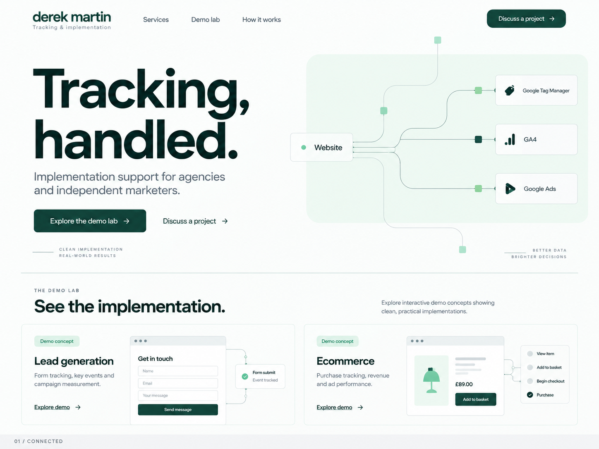

# Derek Martin: website build specification

Ad Ops & Tracking Implementation

Version: 1.1  
Prepared: September 17, 2026  
Deliverable: A working consultancy website ready for content review, followed by production configuration and launch verification.
Revision 1.1: Includes the selected Connected reference PNG, a granular visual system and mandatory visual review criteria.

## 1. Instructions for Codex

Build the website described here. Treat the business decisions as requirements and the implementation defaults as starting choices. Make routine development decisions without repeatedly asking for confirmation. Keep unresolved owner inputs in a central configuration file and a short launch checklist.

Begin by inspecting the repository and its instructions. Open references/connected-selected-reference.png and read the complete visual specification in section 4 before building the layout. The image is included in the accompanying handoff ZIP; keep it alongside this document at the stated relative path. Preserve an existing suitable framework and package manager. For a new repository, use the technical defaults in section 12. Deliver functional routes, responsive layouts, accessible interactions, editable content, and a working inquiry integration boundary. Do not stop at a homepage mockup or a set of nonfunctional buttons.

The initial development milestone is a complete local/preview implementation. Publishing to the owner's production domain is a separate step. Missing production credentials should not prevent page development or testing.

This specification incorporates the latest business decisions. It supersedes earlier suggestions to make Floodlight a secondary service, lead exclusively with GA4, or offer ongoing monitoring retainers.

## 2. Business and positioning

### Business model

Derek provides freelance ad operations and tracking implementation for agencies, former colleagues, independent practitioners, and their clients. Buyers already manage the client relationship or media strategy and need someone to complete the technical work.

Every engagement has a defined beginning and end:

1. Agree on requirements, deliverables, dependencies and acceptance criteria.
2. Obtain the necessary access and specifications.
3. Implement the agreed tracking.
4. Verify behavior and data delivery.
5. Hand over documentation and close the project.

After delivery, new requirements or changes to the client's website can be separately scoped. A defined correction period for defects in delivered work can be covered by the project agreement; its duration has not been decided.

Core selling points: prompt execution, correct implementation, reasonable pricing, and an easy handoff to agency teams. Communicate these through clear scope and evidence. Do not invent turnaround guarantees or prices.

### Working identity

- Display name: Derek Martin.
- Descriptor: Ad Ops & Tracking Implementation.
- Personal-name branding is the working direction; keep it configurable.
- Domain, public email address, logo and final copy remain undecided.
- Do not revive discarded names such as Metric Stitch, Tagwell or Opsright.
- Use a simple typographic wordmark. A custom logo is not a dependency.

### Audience and jobs to be done

| Visitor | Immediate question | Site response |
|---|---|---|
| Agency account or project manager | Can Derek take this technical request off our plate? | Clear service boundaries, process and project inquiry form |
| Paid media practitioner | Can he implement the tags and parameters this platform requires? | Recognizable platform terminology, detailed service descriptions, evidence |
| Agency owner | Can I confidently introduce him to my client or bring him into delivery? | Relevant experience, communication expectations, documented handoff |
| Web developer or technical lead | What does he need from us, and what will he own? | Scope examples, access guide, data-layer and testing expectations |
| Referred prospect | Who is this, and how do I start? | Concise homepage, work examples and direct contact |

### Scope boundaries

Included: advertising tags and pixels, Floodlight, campaign tracking integrations, GA4/GTM, data layers, server-side or offline conversion integrations, audits and repairs.

Not part of the standard offer: media buying, bidding, pacing, campaign optimization, recurring creative rotation, broad SEO/CRO programs, full website development for clients, daily ad operations coverage, or open-ended support.

Describe the positive engagement model prominently. Put detailed boundaries in Services and How It Works without turning the homepage into a disclaimer.

## 3. Outcomes and success measures

The visitor should be able to:

- Understand the specialty within the first screen.
- Find their implementation type without knowing internal terminology.
- Inspect meaningful work and understand what was actually built.
- Learn how a project is scoped, verified and closed.
- Submit an inquiry with enough detail for a useful response.
- Find onboarding guidance after agreeing to work together.

The principal conversion is a successfully submitted project inquiry. Secondary interactions are service exploration, case-study views, demo visits and direct email clicks. Do not invent conversion-rate targets before traffic exists.

## 4. Visual specification: Connected

### 4.1 Reference image, provenance and precedence

The selected image is included with this handoff at **references/connected-selected-reference.png**. It is the original "Connected tracking, handled.png" concept, 1448 x 1086 pixels, copied without editing. Its visible footer reads "01 / CONNECTED".

Open and inspect the PNG before writing layout code. A text-only reading of this document is insufficient for reproducing the chosen visual character. When bringing this into another Codex workspace, extract the complete handoff ZIP so the image remains at the relative path above. Do not treat a link to an unavailable previous-chat attachment as an asset.

Use the image for composition, visual hierarchy, typographic confidence, spacing, color relationships and the quiet technical character. Use this written specification for functional behavior, actual service coverage and responsive adaptation.

| Preserve from the image | Deliberately adapt in implementation |
|---|---|
| Large, left-aligned two-line headline | Retain "Tracking, handled." as working hero copy; name the full ad ops scope in supporting text |
| Dark green ink against an almost-white field | Use the reproducible colors below, not every shade produced by raster compression |
| Pale mint technical illustration on the right | Use accurate, accessible routing labels; explicitly include Floodlight and ad-platform tags |
| Wide, shallow header with a typographic identity | Use the agreed navigation: Services, Work, How It Works, About, Request a Project |
| One solid action and a quieter text link | Use Request a Project as the principal action; Work remains secondary |
| Thin section rules and readable demonstration previews | Use real available evidence; omit unbuilt previews in production |
| Repeated alignment of text, imagery and dividers | Preserve alignment even when copy changes |

Do not reproduce raster artifacts, invented application interfaces, generated platform logos, fictitious verification marks, tiny decorative slogans, or the concept's bottom "01 / CONNECTED" presentation label on the live site. The PNG is a design reference, not a background image or a screenshot to use as the homepage.

The exact measurements below are authored implementation decisions based on inspecting the image. They are not claims that a font or pixel value was mechanically recovered from the original.

The aim is a considered specialist consultancy with a distinct composition. Judge the outcome through the specific craftsmanship criteria in section 4.16: typography, proportion, useful evidence, restrained interaction and deliberate variation between page layouts.

### 4.2 Visual priorities and composition

Priorities, in order:
1. The work and technical specialty are immediately recognizable.
2. Typography provides the primary visual character.
3. One restrained technical illustration reinforces the business.
4. Work examples provide evidence and visual variety.
5. The remaining page is organized with spacing and rules, not repetitive boxes.

Use four distinct section forms on Home: an open two-column hero, an open service index, bordered work previews, and a process list. The closing contact section is a simple line of copy and action. Do not render every section as another card grid.

Keep approximately 80-90% of page area in white or porcelain tones. Dark green is primarily ink and controls; mint is limited to the main illustration and selected evidence backgrounds. Do not introduce a full dark section merely to manufacture contrast. There is no global dot grid or background texture.

### 4.3 Grid, containers and spacing

Use these as the default layout tokens:

| Token | Value | Rule |
|---|---|---|
| Main container | max-width 1280 px | Centered; 80 px outer margins at 1440 px |
| Wide-desktop gutters | 48 px below the 1280 px cap | Keep a comfortable edge at 1024-1375 px |
| Tablet gutters | 32 px | Viewports 768-1023 px |
| Phone gutters | 20 px | Viewports below 768 px |
| Desktop grid | 12 columns, 24 px gap | Used to align major regions |
| Hero at 1440 | 628 px left + 24 px gap + 628 px right | Equal columns inside 1280 px container |
| Reading width | max-width 680 px | Body prose, FAQs and policy text |
| Dense technical reading width | max-width 840 px | Evidence tables and implementation notes |
| Space scale | 4, 8, 12, 16, 20, 24, 32, 40, 48, 64, 80, 96, 120 px | Prefer these values |
| Major section spacing | 96 px desktop, 72 px tablet, 56 px mobile | Reduce where a rule already creates separation |
| Section heading to content | 32 px desktop, 24 px mobile | Apply consistently |
| Heading to paragraph | 20-24 px | Not the same as paragraph-to-paragraph spacing |
| Paragraph spacing | 16 px | Avoid large holes within one thought |
| Boundary rule | 1 px | Align with the container, not the browser edge |

At widths >= 1024 px, use the two-column hero. Below 1024 px, place hero copy first and the illustration beneath it. Never scale the entire desktop screenshot down to fit a phone.

Use padding for page rhythm; do not set fixed section heights or min-height: 100vh. Content growth must remain safe. Allow purposeful optical adjustments within roughly 4 px, but record significant departures from these tokens rather than introducing dozens of unexplained values.

### 4.4 Typography

Use **Manrope** as the single primary family. Its broad, rounded sans-serif forms are a deliberate translation of the reference's character. This replaces the earlier provisional Inter choice. Load a licensed local font or a framework-managed self-hosted asset, and retain the supplied license. [Manrope license in the Google Fonts repository](https://github.com/google/fonts/blob/main/ofl/manrope/OFL.txt)

Use the variable font with a weight range covering 400-800 so intermediate weights such as 650 and 750 are intentional rather than browser-synthesized.

Fallback stack: Manrope, Arial, sans-serif. Fallback is for loading/failure, not an unreported final font substitution. Use a system monospace stack only for event names, identifiers or code in evidence.

| Role | Desktop size / line height | Mobile size / line height | Weight / tracking |
|---|---|---|---|
| Wordmark | 27 / 30 px | 23 / 27 px | 750, -0.045em |
| Wordmark descriptor | 11 / 16 px | 10 / 14 px | 500, +0.08em |
| Navigation | 14 / 20 px | 18 / 26 px in expanded menu | 500, normal |
| Home H1 at 1440 | 112 / 108 px | 64 / 63 px at 390; 58 / 58 px at 360 | 750, -0.055em |
| Inner-page H1 | 64 / 68 px | 40 / 44 px | 650, -0.04em |
| Section H2 | 42 / 48 px | 30 / 36 px | 650, -0.035em |
| Service or work title | 26 / 32 px | 23 / 29 px | 650, -0.025em |
| Hero introduction | 21 / 31 px | 18 / 28 px | 450, -0.015em |
| Standard body | 17 / 28 px | 16 / 26 px | 400, normal |
| Secondary body / field hint | 14 / 22 px | 14 / 22 px | 400, normal |
| Small label | 11 / 16 px | 11 / 16 px | 600, +0.10em |
| Button / action | 14 / 20 px | 15 / 22 px | 600, normal |
| Evidence code | 13 / 21 px | 13 / 21 px | 400, normal |

At desktop widths between 1024 and 1440, scale the home H1 from approximately 80 to 112 px. At 768-1023, target 88 / 86 px in the stacked composition. Above 1440, cap at 120 px; do not grow indefinitely.

Keep the working hero phrase on two intentional lines: "Tracking," followed by "handled." Use a single accessible H1 with line spans. Do not force these line breaks onto replacement copy. For inner-page headings, prefer natural wrapping and balanced text when supported. Never force a heading into a 200 px column or reduce it to tiny type to avoid changing a layout.

Normal body copy should average roughly 55-75 characters per line. Hero copy can be shorter. Use sentence case. Reserve uppercase letter-spaced labels for occasional section/evidence identifiers, not every paragraph or every page title.

### 4.5 Color and surface rules

| Token | Value | Application |
|---|---|---|
| --canvas | #FBFCFA | Main background |
| --surface | #FFFFFF | Form controls and genuine preview frames |
| --ink | #073D33 | H1, H2, wordmark, primary buttons |
| --body | #253E37 | Main reading text |
| --muted | #596B64 | Supporting text and field hints |
| --mint | #EDF6F0 | Hero technical field, occasional evidence backdrop |
| --mint-strong | #D9EEE2 | Small category label or selected state background |
| --accent | #94CFB3 | Decorative nodes only |
| --line | #D3E1D9 | Section rules and noninteractive frame borders |
| --control-border | #7C9588 | Field outlines when needed for visibility |
| --focus | #145E49 | Visible focus ring |
| --error | #A52B2B | Error text and error-state outline |
| --hover-ink | #0D5143 | Primary-control hover state |

These values replace the earlier color table. Check contrast in the actual font sizes and backgrounds. Noninteractive dividers may be subtle; input boundaries, active controls and text must remain perceivable.

Use flat fills. The slight mottling/lighting in the generated reference is not a requirement. Do not add grain, glow, animated gradients, glass surfaces, blurred color clouds or gradient text. If real imagery introduces more colors, keep the surrounding frame neutral.

The mint field is a compositional support for the hero illustration, not a background repeated behind every section.

### 4.6 Header and footer

**Header**

- Height: 96 px desktop, 76 px mobile.
- Background: canvas, opaque.
- Default: normal document flow; no sticky/frosted header in version 1.
- Identity: left-aligned lowercase visual wordmark "derek martin"; accessible name remains Derek Martin.
- Descriptor below the name: "Ad ops & tracking implementation." Keep it quieter than navigation.
- Navigation: right-aligned group; 28 px between links; 32 px before CTA.
- Header CTA: 44 px minimum height, 18-20 px horizontal padding, 8 px radius.
- Link active state: thin underline with a 5-6 px offset. No filled navigation pills.
- Keep the wordmark and navigation vertically optically centered; don't align navigation to the descriptor baseline.
- At widths where the full navigation no longer fits, switch to Menu; never squeeze navigation into illegible text.

**Mobile navigation**

Use a button with "Menu" and a small icon. Open a full-width panel directly beneath the header in normal flow. Use plain stacked links with 16 px vertical padding and a final project button. Do not add a drawer, dimmed backdrop and focus trap unless changing to a genuinely modal implementation. Hide collapsed links from tab order. Escape closes and returns focus to Menu.

**Footer**

Use a single top rule, 40 px top padding and 32 px bottom padding. On desktop, identity and short descriptor sit left; navigation and contact sit right. On phones, stack these with 24 px gaps. No giant repeat of the hero, newsletter signup or dense sitemap. Cookie controls appear only if actually needed.

### 4.7 Home hero: exact construction

At a 1440 px viewport:
- Header occupies approximately y=0-96.
- Hero starts with 64 px top padding.
- Copy starts at the container's left edge, approximately x=80.
- Left and right regions are equal grid columns.
- Place an 11 px descriptor above the H1 only if needed to clarify scope; avoid duplicating the wordmark descriptor mechanically.
- H1 first line is "Tracking,"; second is "handled."
- Gap from H1 to supporting copy: 24 px.
- Intro width: max 530 px; two or three lines depending on final wording.
- Gap from intro to actions: 28 px.
- Primary action: Request a Project, approximately 184-208 px wide based on text and padding, 48 px tall.
- Secondary action: View the Work, text link with a small right arrow, 24 px away from the button.
- Hero bottom padding: 64 px.
- The figure should occupy roughly 600 x 420 px, vertically centered against the headline and intro; it may extend slightly above the H1 baseline but must not touch the header.
- The next section should begin to appear around the lower portion of an ordinary desktop viewport; avoid another empty screen after the hero.

At 390 px:
- Available content width is 350 px.
- Hero top padding: 32 px.
- H1 uses 64 / 63 px.
- Intro starts 20 px below the heading.
- Actions start 24 px below the intro. Stack if a comfortable inline arrangement cannot fit; primary first.
- Figure follows 36 px later at full available width.
- Hero bottom padding: 40 px.
- No horizontal clipping, tiny diagram labels, or offscreen connectors.

Keep the first-screen copy focused. Detailed defect-correction terms and service disclaimers belong further into the site.

### 4.8 Hero illustration

The reference's routing motif is the only decorative hero illustration. Build it with crisp vector lines and live text; do not use the reference screenshot as an image layer in the live UI.

Desktop design:
- Overall figure box: width 100%, max-width 628 px, aspect ratio about 1.45:1.
- Mint field: inset approximately 24 px from the figure's left edge, extending to the right; radius 24 px.
- Use one route source, an implementation/tag-management step, and a short destination group.
- Label the flow as illustrative with a small caption below the figure.
- Suggested text: "Website event", "Tag configuration", then "GA4", "Floodlight", "Ad platform".
- Place source and configuration vertically on the left/middle; group the destinations vertically on the right. Keep no more than three horizontal levels.
- Show arrow direction clearly and keep the topology technically plausible. It illustrates possible work, not a claim that all clients use this exact architecture.
- Lines: 1-1.25 px, muted green, rounded orthogonal bends with 20-28 px corner curves.
- Nodes: 6-8 px squares or circles; use at most four decorative nodes.
- Labels: 13-14 px with real text.
- Node panels: white/near-white, 1 px line border, 6-8 px radius, no drop shadow.
- No invented official brand logos. Use text labels and minimal neutral glyphs if needed.
- No animated event counters, heartbeat pulses, "100% healthy" badges or simulated client data.
- No functional controls inside a purely illustrative figure.

Mobile:
- Use a genuinely rearranged composition with a full-width source/configuration path above a compact destination list.
- Keep labels at least 12 px, preferably 13 px.
- Do not shrink the desktop SVG uniformly until words become unreadable.
- Supply a concise accessible description. Decorative connector paths should not be focusable.

The graphic may simplify on small screens, but it must continue to communicate an implementation specialty. A lone abstract blob is not an acceptable substitute.

### 4.9 Service presentation

Home uses an **open service index**, not five identical cards:
- Section title and short introduction occupy the left four columns.
- The five service links occupy the right eight columns.
- Each service row has a title, one short sentence and a trailing arrow.
- Separate rows with thin rules; use 24 px vertical padding.
- Do not add a colored icon tile to each service.
- Keep actual title lengths; do not force every description to the same word count.
- Ad Tags & Pixels is the first row; Floodlight & Campaign Tracking is second.
- On mobile, title/introduction appear above the list with 28 px separation.
- Row hover may darken the title or shift its arrow 2 px; the row itself does not float or cast a shadow.

Services detail page:
- Intro uses a 7/5 desktop split: title/introduction left, compact service jump list right.
- Each service section starts after a full-width rule.
- A left three-column rail holds the service number/title; the right nine columns contain scope, examples and deliverables.
- Present deliverables as clear text lists. Do not wrap each bullet in a box.
- Scoping inputs can use a narrow mint-tinted strip when that makes them easier to scan.
- CTA is a text action or one modest button at the end of the section.
- Mobile is a single reading column; the number and heading remain together.
- Service details are visible by default, not hidden in five accordions.
- Anchor targets have enough scroll margin that headings remain readable.

### 4.10 Work previews and evidence styling

The two preview panels in the reference are the precedent for cards. Cards are reserved primarily for discrete work examples.

Work preview:
- White surface, 1 px --line border, 10 px radius.
- No shadow by default.
- Padding: 28 px desktop, 20 px phone.
- Title and summary remain outside any screenshot's pixels as real text.
- Evidence type label: 11-12 px on pale mint, 4 px radius, small padding. It describes "Demonstration" or "Client case study"; it is not a status badge.
- Platform names: inline muted text, separated by commas or small dots; avoid a rainbow of pill chips.
- Screenshot/preview: neutral field with consistent aspect ratio, generally 16:10 or 4:3. Choose one per collection.
- Crop without cutting off the content needed to understand the implementation.
- Use object-fit deliberately. Do not stretch images.
- Two examples can sit in equal columns; a third should be a deliberate full-width feature row or start a clean second row. Do not leave a lonely miniature card.
- At <768 px, stack full-width.
- Whole-card navigation must not contain nested competing links. Prefer a title link plus distinct demo action with separate hit areas.
- Hover: border darkening and underline on the title. No lift, tilt, parallax or bouncing arrow.

Inside a case:
- A short summary rail can show Service, Platforms and Evidence type.
- Use real screenshots in a calm browser/document frame if helpful, not floating device mockups.
- Test tables use a light header row, 14 px text, 12-16 px cell padding and horizontal rules.
- Result labels are plain language and only reflect observed tests.
- Technical snippets use a pale neutral panel, 6 px radius and restrained syntax treatment.
- Each screenshot has a short caption explaining what it proves.
- Avoid tiny cropped dashboards that look impressive but cannot be read.

### 4.11 Inner-page composition

| Page | Desktop composition | Mobile adaptation |
|---|---|---|
| Work | Intro above a featured case row, then two-column examples if enough cases exist | One column; preview follows title and summary |
| Case study | Title/summary width 840 px; wide evidence figure; 8-column article plus 3-column facts rail with a gap | Facts become an inline definition list; article follows |
| How It Works | Narrow intro; six numbered rows with number in a small rail and explanation beside it | Number above or beside heading; no cramped horizontal timeline |
| About | Short title; 7-column narrative and 4-column practical details rail; optional modest portrait | Narrative first; portrait/details below |
| Contact | 4-column introduction and 7-column form with one column of breathing room | Intro then form; no fixed side panel |
| Privacy | Quiet heading and 680 px reading column | Same single-column structure |
| Getting Started | Introduction, short contents list and readable instructional sections | One column; access steps remain numbered |
| Thanks / 404 | Compact left-aligned message in normal page layout | Same; avoid oversized success illustrations |

Use a consistent alignment system, but do not force identical hero and three-card arrangements onto every route.

### 4.12 Form visual details

Use a plain form on the page canvas, not a large elevated signup card.

- Labels: 14 px, weight 600; 8 px above the field.
- Inputs: 48 px minimum height; 12-14 px horizontal padding; 6 px radius.
- Input text: at least 16 px on phones.
- Textarea: min-height 160 px, vertically resizable.
- Fields separated by 24 px; labels/hints separated by 6-8 px.
- Background: white; outline uses --control-border.
- Placeholder is an example, never the only label.
- Focus: visible 2 px ring with 2 px offset or an equally clear accessible treatment.
- Invalid field: error outline plus a written message; do not make the entire form red.
- Error summary stays close to the form and links/focuses affected fields.
- Loading button maintains its width so the layout does not jump.
- Disabled state remains readable.
- Optional fields are clearly labeled optional.
- No oversized enclosing gradient, mascot or decorative shield.
- Date and select controls use predictable accessible behavior rather than a heavily customized widget.
- Success state uses a brief written confirmation and small check mark at most.
- Provider/configuration errors appear as useful plain-language status text, not developer exception strings.

Keep content responsive when error messages become two or three lines. The page must not jump to an unrelated scroll position after validation.

### 4.13 Buttons, links, icons and borders

- Primary button: solid --ink, white text, 8 px radius, 48 px height; 44 px in header.
- Horizontal padding: 20-24 px.
- Hover: --hover-ink fill.
- Active: slightly deeper fill; no scale bounce.
- Focus: distinct outline, visible against canvas and mint.
- Text action: underlined text with arrow; underline offset 4 px.
- Inline prose links: visibly underlined without hover.
- Arrow glyphs: one consistent 16 px line icon, 1.5-1.75 px stroke.
- Icons are utility cues, not substitutes for labels.
- No emojis or a different icon treatment in each section.
- Small panel radius: 6 px; work cards: 10 px; hero mint field: 24 px.
- No default pill buttons, nested rounded cards or repeated shadows.
- Borders must serve grouping or navigation; do not outline every text fragment.

### 4.14 Motion and interaction

Default transitions: 140-180 ms for color/border/opacity, ease-out. Maximum deliberate positional movement is 2 px on an arrow. All content is immediately visible when rendered.

No entrance animation on every section, typewriter headline, number counter, mouse-follow spotlight, magnetic button or continuously moving connector. Reduced-motion users receive the same complete experience without motion.

Use native scroll for anchors. If smooth scrolling is enabled, respect reduced motion and ensure it does not interfere with focus or browser navigation.

### 4.15 Editorial detail and restraint

- Leave enough variation for content to sound written: one service may need two examples, another four.
- Avoid a pill-shaped eyebrow above every heading.
- Avoid repeating "Precision. Performance. Results." style slogans.
- Do not fill whitespace with decorative checklists.
- Use actual agency requests and actual evidence when available.
- Keep no more than one dominant CTA group per section.
- The home closing CTA is a rule, one strong sentence and one action, not a giant promotional banner.
- Do not add fake social proof to compensate for a small portfolio.
- A quiet empty state is preferable to three invented projects.
- Avoid repeating the whole service list in the hero, footer and every case.
- Do not stretch a short About page to match the length of Services.

### 4.16 Visual acceptance gate

Functional completion is not sufficient. Before handoff, render actual pages and inspect them at desktop and mobile sizes.

Required screenshot set:
- Home at 1440 x 1000 and 390 x 844.
- Services at 1440 px and 390 px widths, including a complete Floodlight section.
- Work/case study with real content or clearly marked development fixtures.
- Contact at 1440 px and 390 px widths, including validation errors.
- Expanded mobile navigation.

Review the Home screenshot side-by-side with the selected PNG. Do not use a pixel-difference test against the generated mockup: copy, routing and mobile adaptations intentionally differ. Compare:
1. Left-aligned, oversized two-line headline.
2. Balance between typography and the pale technical figure.
3. Consistent container alignment and page margins.
4. Dark-green/porcelain/mint relationship.
5. Clear primary action and quiet secondary action.
6. Useful information density near the first screen.
7. Readable work previews.
8. Variation in section structure below the hero.

Reject the build if:
- It becomes a centered headline over a generic card grid.
- Every section uses identical boxes and icon badges.
- Mobile merely shrinks the desktop illustration.
- Typography or image assets fail to load.
- Text collides, wraps into isolated one-word lines unnecessarily, or looks mechanically squeezed.
- Screenshots or buttons suggest functionality that does not exist.
- Shadows, gradients or gratuitous motion become the main visual identity.
- A different screenshot/reference is silently substituted for Connected.

After reviewing screenshots, correct the observed issues and record a short design QA note describing what was checked and any intentional departures. Do not claim the site matches the reference without having rendered it.

## 5. Information architecture

Seven primary pages, two supporting pages, a reusable case-study route, and a custom 404.

| Route | Page | Navigation | Indexing |
|---|---|---|---|
| / | Home | Wordmark | Yes |
| /services | Services | Main | Yes |
| /work | Work / Portfolio | Main | Yes |
| /work/[slug] | Individual case study | From Work and related services | Published entries only |
| /how-it-works | How It Works | Main | Yes |
| /about | About | Main | Yes |
| /contact | Request a Project | Primary CTA and footer | Yes |
| /privacy | Privacy Notice | Footer | Yes after approved content exists |
| /contact/thanks | Inquiry confirmation | Submission flow | No |
| /getting-started | Client onboarding / access guide | Direct client link | No |
| Invalid routes | 404 | Recovery links | No |

Use one contact route everywhere. Do not create competing Contact and Request a Project forms.

A standalone pricing page, blog, client portal, checkout, account registration and individual service landing pages are outside version 1. Build FAQ sections into existing pages.

## 6. Page specifications

### 6.1 Home

Purpose: establish the specialty, demonstrate credibility, and direct visitors toward a project request.

Section order:

1. **Hero**
   - Descriptor: Ad Ops & Tracking Implementation, either in the header or above the hero, without unnecessary repetition.
   - Working headline: "Tracking, handled." Set on two lines as specified in section 4.7.
   - Working supporting copy: "Ad tags, Floodlight and analytics implementation for agencies and independent marketers. Scoped, tested and ready to hand off."
   - Primary CTA: Request a Project.
   - Secondary CTA: View the Work.
   - Include the restrained routing illustration specified in section 4.8. Its labels include Floodlight and ad-platform tagging. Identify it as illustrative; it must not look like live client telemetry.
2. **Service overview**
   - All five services visible with concise descriptions.
   - Ad Tags & Pixels and Floodlight & Campaign Tracking appear first.
   - Present an open list of ruled service rows, as specified in section 4.9. Rows link to anchored sections on Services.
3. **Selected work**
   - Up to three published cases.
   - Show type, implementation focus, platforms and one real proof point.
   - If no published cases exist, show a purposeful short state with a project CTA. Never publish fake case studies to fill the layout.
4. **Process**
   - Scope, Implement, Verify, Handoff.
   - One line per stage, link to How It Works. Use a simple numbered text list with generous spacing, not another card grid.
5. **Why work with Derek**
   - Relevant agency experience.
   - Defined technical ownership.
   - Documented testing and handoff.
   - Use accurate prose; no fabricated client logos or numerical claims. Present a concise editorial text section, without icon tiles or a second hero.
6. **Closing CTA**
   - Working text: "Have an implementation to get off your list?"
   - Button to Contact. Use a top rule and compact copy/action layout; no full-width colored promotional banner.

Acceptance: on a 390 px screen, a visitor can quickly see the specialty and CTA. Floodlight and ad-network work must not be hidden behind analytics-first messaging.

### 6.2 Services

Purpose: map the buyer's request to a clearly bounded project.

Start with a short explanation of implementation engagements. Provide a jump list to the five service sections. Use stable anchors matching the service IDs below.

For every service, show:
- What the work covers.
- Typical project requests.
- Typical deliverables.
- Information/access needed for scoping.
- Related work, if published.
- CTA: Discuss This Implementation, preselecting the service on Contact.

Do not display invented platform expertise. The categories are agreed; individual platform examples should remain configurable and be checked by Derek before launch.

**S1: Ad Tags & Pixels**  
ID: ad-tags-pixels

Covers conversion, remarketing and audience tags for advertising platforms, networks and DSPs; event parameters, values and identifiers; tag-manager or agreed direct-code installation.

Examples: a new network's site pixel, platform conversion events, audience tags, supplied partner tag specifications.

Potential platform examples, subject to confirmed support: Google Ads, Meta, LinkedIn, Microsoft Advertising, TikTok and client-specified DSP/network tags.

Deliverables: implemented tags, agreed event mapping, validation evidence, configuration notes.

Scoping inputs: platform and account, vendor specifications, website technology, relevant journeys, tag-manager access and developer contact where needed.

**S2: Floodlight & Campaign Tracking**  
ID: floodlight-campaign-tracking

Covers Floodlight activities, appropriate counting behavior, conversion values, transaction identifiers and custom variables; impression/click trackers; URL parameters and macros; third-party verification integrations when scoped.

Examples: a Floodlight implementation for a campaign launch, custom-variable mapping, a tracker chain across an ad server and media partner, verification tag QA.

Potential platform examples: Campaign Manager 360, Display & Video 360, IAS and DoubleVerify, subject to access and confirmed experience.

Deliverables: implementation map, configurations/tags, relevant firing or request evidence, limitations and handoff notes.

Scoping inputs: advertiser/account access, activity definitions, counting/value requirements, placements or vendor documentation, site access and test environment.

Keep this service visually equal to GA4/GTM. It is a principal offering.

**S3: GA4 & GTM Implementation**  
ID: ga4-gtm

Covers property/container configuration, event tracking, custom dimensions, data-layer specifications, cross-domain measurement, lead-generation and ecommerce journeys.

Examples: successful form submissions, booking journeys, product/cart/checkout/purchase events, a measurement rebuild after a redesign.

Deliverables: event plan, configurations, agreed data-layer work, test journeys and handoff documentation.

Scoping inputs: properties/containers, relevant domains, website stack, key business actions, developer dependencies and consent requirements.

Ecommerce is a visible subsection of this service, not a separate sixth category.

**S4: Server-side & Offline Conversions**  
ID: server-offline-conversions

Covers supported conversion APIs, server-side tagging, browser/server deduplication, and CRM or offline conversion feeds.

Examples: server event delivery to an ad platform, a qualified-lead milestone returned from a CRM, transaction signals sent from a backend.

Deliverables: source-to-destination mapping, configured integration, field and deduplication tests, deployment/ownership notes and operating instructions.

Scoping inputs: source and destination, event definitions, consent requirements, identifiers, hosting ownership, API access and existing integrations.

Ongoing hosting or subscription costs are separate from implementation fees. Do not imply ongoing monitoring is included. Keep exact supported integrations editable.

**S5: Tracking Audits & Repairs**  
ID: audits-repairs

Covers missing/duplicate conversions, unexpected values, broken triggers, tag conflicts and implementation discrepancies.

Examples: a setup inherited from another agency, conversions failing after site changes, conflicting tags or incorrectly populated values.

Deliverables: reproducible findings, prioritized repairs, implemented agreed fixes and retesting.

Scoping inputs: observed symptoms, affected platforms, expected behavior, dates of changes, access and available evidence.

An audit may end with findings and a repair scope. A combined engagement may include repairs. Display this distinction plainly.

**Add-ons and FAQ**

Consent configuration belongs beneath relevant services: implement the client's approved requirements and test tag behavior. Verification integrations belong under Campaign Tracking. API/script work is included where necessary to the defined implementation, not positioned as unlimited automation consulting.

Answer these questions concisely:
- Can you work alongside our agency or developer?
- Can you work behind the scenes for our client?
- Do you manage campaigns after implementation?
- How is the work priced?
- What access will you need?
- How do you confirm that it works?
- What if the website changes later?
- Can you diagnose the issue before quoting a repair?

For behind-the-scenes support, use "Agency collaboration and client communication can be agreed during scoping." Do not promise a contract model or unrestricted white-label coverage that has not been decided.

### 6.3 Work / Portfolio

Purpose: demonstrate competence with inspectable work and understandable evidence.

Each card includes title, one-line problem, relevant services, platform names, a thumbnail and evidence type. Use three evidence types: demonstration, client case study, technical walkthrough.

Do not add filters for a small portfolio. If the collection grows, filters may be added later.

Publish real available work only. Client names, logos, screenshots, results and account identifiers require owner-supplied publishable material. Do not automatically name Tyne, reuse her assets, or present her project as a public case study.

Draft fixtures may exist in development to exercise layouts, clearly labeled and excluded from the production portfolio, sitemap and generated routes.

### 6.4 Individual case study

Template sections:

1. Title, evidence type, summary and relevant platforms.
2. The requirement and business context.
3. Scope of the implementation.
4. Architecture or data flow, if it aids understanding.
5. What was implemented.
6. Verification evidence: scenario, expected behavior, observed result.
7. Challenges and resolutions.
8. Limitations and what the demonstration does not exercise.
9. Links to live demo, walkthrough video or sanitized technical artifacts when available.
10. Related service and Request a Similar Implementation CTA.

Proof must be concrete. "Purchase sent once with the expected value in the tested checkout flow" is useful only when supported by an actual test. Never invent ROAS improvements or claim platform acceptance from a mock event console.

Images must be real files rendered visibly, not missing placeholders. Give useful alt text, dimensions and responsive sizing. Lazy-load videos or use click-to-play thumbnails.

A link to a demo and a link to a case study are separate actions with clear labels. Do not load external demos inside the main page automatically.

### 6.5 How It Works

Explain six steps:
1. Submit the project.
2. Agree on scope, pricing, dependencies and success criteria.
3. Provide account access and technical materials.
4. Complete the implementation.
5. Run the agreed tests and resolve implementation defects.
6. Deliver the handoff and close the engagement.

Explain completion in practical terms: agreed events/parameters behave as specified and arrive at the intended destinations within the documented test scope. Some platforms require processing time; do not equate a browser request with confirmation in the destination.

Show a sample handoff contents list: event/tag inventory, configuration changes, test results, ownership, known limitations and maintenance instructions.

Include a short section covering:
- Delivery estimates begin once necessary access/materials are available.
- Agency and developer responsibilities are agreed up front.
- Later changes can be quoted as new work.
- Defect correction follows the agreed project terms.
- Campaign outcomes such as ROAS are not implementation acceptance criteria.

Do not publish an invented SLA, correction-period duration or rush-work guarantee.

### 6.6 About

Use a short professional narrative centered on Derek's agency experience and technical implementation ability.

Available background: eight years in digital marketing; experience at Metric Theory, Wpromote and Ask.com; hands-on work with tagging, analytics, APIs, scripts, SQL and reporting. Draft from these facts without inventing quantified results or implying employer endorsement.

Use first person where natural. The business is a specialist consultancy, not a fictional team. A subtle personal photograph may be added later.

Security experience can be a brief supporting detail if useful, but the page must read as an ad ops consultancy. Do not import unrelated career-search or family information.

### 6.7 Contact / Request a Project

One-page form, not a multi-step questionnaire. Clearly explain that submitting starts a scoping conversation and does not book work or incur a charge.

Suggested introduction: "Tell me what needs implementing, which platforms are involved and when you need it. I’ll review the scope and follow up."

Exact fields, validation and delivery behavior are in section 8.

Show an email alternative when a real address is configured. Response-window text and availability are configurable; omit them when unknown.

### 6.8 Privacy Notice

Build a readable legal-content template, then populate it from actual operating details.

Content needs to identify the operator/contact, inquiry data collected, purposes, recipients/processors, retention, analytics/cookies if used, and contact procedure. Exact obligations and wording require review appropriate to the launch configuration and jurisdictions.

No fake "fully compliant" claims or copied generic policy. During development, show an explicit draft state. Before public launch, replace it with reviewed, accurate content. Do not enable tracking just to justify a cookie banner.

### 6.9 Inquiry confirmation

Route: /contact/thanks.

After successful submission, show a concise confirmation and what happens next. Provide links back to Work and How It Works. Display a harmless request reference only when available.

Direct navigation or refresh without a valid submission receipt must not falsely claim a new inquiry was submitted. Render a neutral state with a link to Contact.

This page must never independently generate a lead conversion merely because someone visits it.

### 6.10 Client onboarding / access guide

Route: /getting-started.

A generic, noindex guide for clients after scope agreement. Cover:
- Who owns the approval and technical contact roles.
- Inviting account access using platform permissions.
- Providing tag specifications, event definitions and test journeys.
- Coordinating staging/production access and deployment.
- Confirming the agreed consent behavior.
- What the client receives at handoff.

Do not collect passwords, tokens, customer exports or production account IDs through this public page. Noindex is not access control. Keep project-specific materials in the agreed private workflow.

Link to official platform access instructions when implemented and verified. Do not guess invitation addresses or instruct clients to grant universal admin access by default.

### 6.11 404

A calm, branded page with links to Home, Services and Contact. Unknown or unpublished case slugs return a real 404 rather than a blank page or generic success response.

## 7. Required visitor journeys

| Journey | Expected behavior |
|---|---|
| Referral arrives on Home | Understand offer, inspect a service, request a project |
| Buyer needs Floodlight | Reach its service section directly, see deliverables, open Contact with Floodlight preselected |
| Buyer inspects a case | Understand evidence type, visit an available demo, return to request related work |
| Buyer is unsure what is broken | Select "Not sure / help scoping" and describe symptoms |
| Inquiry submission succeeds | Receive clear confirmation after server acknowledgment |
| Validation or delivery fails | Keep entered values, explain the problem, allow a controlled retry |
| Client receives onboarding link | Read generic access instructions without creating an account |
| Visitor reaches missing content | See a useful 404 with working recovery links |

Prefilled links:
- /contact?service=floodlight-campaign-tracking
- /contact?service=ad-tags-pixels
- /contact?service=ga4-gtm
- /contact?service=server-offline-conversions
- /contact?service=audits-repairs

Only allow known service values. An invalid value falls back to the default selection and is never rendered as raw content.

## 8. Inquiry form specification

### Fields

| Field | Required | Control and validation |
|---|---|---|
| Name | Yes | Plain text, trimmed, 1-100 characters |
| Email | Yes | Email input, reasonable syntax validation, maximum 254 characters; allow personal email domains |
| Agency / company | No | Plain text, maximum 150 characters |
| Client website | No | URL input, maximum 2048 characters; allow normal domains to be normalized to HTTPS; accept HTTP/HTTPS only |
| Main service | Yes | Single select: five service IDs plus "Not sure / help scoping" |
| Platforms involved | No | Plain text, maximum 300 characters; helper examples such as CM360, Google Ads, GTM |
| Project description | Yes | Textarea, trimmed, 20-5000 characters |
| Target timing | No | Select: Flexible, Within a month, Within two weeks, Urgent, Specific date |
| Desired date | Conditional | Date input shown for Specific date; not a guaranteed delivery commitment |
| Budget range / budget note | No | Optional plain text, maximum 150 characters; do not invent minimums or ranges |
| Privacy explanation | Always visible | Short explanation of inquiry use with a Privacy link; no marketing subscription |

Helper text beneath Project description: "Please leave out passwords, access tokens and customer data. We can arrange access once the scope is agreed."

No required phone number, mailing address, account IDs, file attachments, calendar booking, newsletter opt-in or lengthy intake quiz. Technical briefs can be shared later through the agreed workflow.

### Presentation

- Desktop form width roughly 640-720 px.
- Name/email may share a row on larger screens; stacked on mobile.
- Labels remain visible above inputs.
- Required fields are explicitly marked.
- Helpful examples appear as short hints, not long paragraphs.
- The optional information should feel optional.
- Submit label: Send Project Request.
- Inline loading label: Sending…
- Put field errors next to fields and focus the first invalid field or error summary.
- Use accessible live announcements for submission status.
- Do not communicate errors through color alone.

### Server-side processing

Client validation improves usability; validate again on the server using the same schema.

On a valid request:
1. Validate request type, payload size, field types, allowed service values and anti-abuse controls.
2. Generate or validate a non-PII submission ID and apply idempotency for retries.
3. Format a safe plain-text or escaped HTML notification.
4. Send to the configured owner inbox using an authenticated provider.
5. Return success only after the provider accepts the message, or after a deliberately configured durable queue accepts it.
6. Issue a short-lived confirmation receipt so the thanks page can distinguish a successful submission from direct navigation.

For version 1, prefer synchronous provider acknowledgment. Use a small signed receipt in a secure cookie or an equivalent server-verifiable mechanism; never put names, emails or project text in the URL. A receipt only supports confirmation display and expires automatically. Do not expose provider IDs unnecessarily.

Provider acknowledgment is not proof of inbox delivery. A launch test must confirm receipt in the actual owner inbox.

Implementation defaults:
- No custom CRM or database for lead management.
- Email is the initial delivery destination.
- Hosting/provider-backed anti-abuse or idempotency storage is acceptable where needed. Do not rely on a per-process memory map across serverless instances.
- Notification From uses a verified sender. Put the validated visitor email in Reply-To.
- Do not use visitor-controlled input directly in mail headers.
- Include submitted fields, timestamp and source service in the notification.
- Do not fetch the user-supplied website URL on the server.
- No automatic acknowledgment email to the visitor in version 1.
- No account credentials or personal details in public logs or analytics events.

### Failure and abuse behavior

Support these states explicitly:
- Idle.
- Invalid fields.
- Submitting.
- Submitted.
- Rate limited.
- Provider unavailable or missing configuration.
- Network timeout where submission status is uncertain.

Use a basic honeypot and a durable rate-limiting facility. Do not add an intrusive challenge unless abuse makes it necessary. Document the chosen limits and storage mechanism. Prevent accidental duplicate sends through the disabled submit state and provider/storage-backed idempotency.

Use bounded request sizes and timeouts. Retain user-entered values in component memory after errors; do not persist project text to browser storage by default.

For a timeout, do not claim definite failure or success if the provider outcome is unknown. Show "I couldn’t confirm that your request was sent. Please retry or use email." Reuse the same submission ID for that retry.

For a provider outage or absent credentials, show a plain-language error and the configured email alternative. The production site must not show success while dropping the inquiry.

### Development mode

Support an explicit mock delivery adapter in local development/preview:
- It returns synthetic success/failure without sending email.
- The development UI makes the test state clear.
- Test notifications never reach real clients.
- Production configuration cannot enable this adapter.
- Missing delivery credentials in production fail safely.

Exercise real provider delivery only with an owner-specified test recipient. Never send test messages to prior clients by inferring their addresses from conversation history.

## 9. Content and configuration

Content must be editable without changing component structure. Use typed local content for site-wide values and service definitions. Case studies can use local Markdown with validated frontmatter. A CMS is unnecessary for version 1.

### Site configuration

| Field | Initial value / rule |
|---|---|
| displayName | Derek Martin |
| descriptor | Ad Ops & Tracking Implementation |
| canonicalOrigin | Unset until the domain is chosen |
| publicEmail | Unset; do not assume a personal/work inbox is approved |
| socialLinks | Empty until confirmed |
| responseWindowText | Empty until confirmed |
| availabilityText | Empty until confirmed |
| pricingText | "Projects are scoped and quoted based on the implementation." as provisional copy |
| portrait | Optional, unset |
| analyticsEnabled | False until IDs and consent behavior are configured |
| portfolioEmptyText | Short honest message, editable |
| correctionPolicyText | Refers to agreed project terms; no invented duration |
| privacyContentApproved | False until actual operating details are reviewed |

Keep owner-facing setup notes out of public pages. In development, unresolved items can appear in a clearly marked review panel. In production, optional fields are omitted gracefully; essential configuration remains a release blocker.

### Service records

Fields: id, title, summary, scope bullets, request examples, deliverables, scoping inputs, platform examples, related case slugs, CTA label and display order.

All five sections use the exact IDs in section 6.2. Platform examples have an owner-confirmed flag or are held as draft content until verified. Do not sprinkle independent platform lists around components.

### Case-study records

Fields:
- slug, title, summary.
- status: draft or published.
- evidenceType: demonstration, client-case-study, technical-walkthrough.
- serviceIds and platform labels.
- hero image and alt text.
- requirement, scope, implementation and challenges.
- verification rows: test scenario, expected behavior, observed result, optional artifact.
- limitations.
- demo URL, video URL and artifact links, each optional.
- lastVerifiedAt, optional and only populated from an actual test.
- permissionConfirmed for public client-identifying material.

Published cases must have substantive implementation and verification content. A missing demo URL hides that action rather than producing a broken button. Drafts do not generate production pages or appear in related-work components.

### Copy rules

All initial marketing copy is editable working copy. The owner intends to refine it later.

Use:
- Plain English and specific deliverables.
- Recognizable terms such as Floodlight, GTM and conversion tracking.
- First person for Derek when appropriate.
- Clear ownership and handoff language.

Avoid:
- Em dashes.
- Fictional staff, client testimonials or case results.
- Generic slogans about unlocking growth or transforming businesses.
- Claims of perfect attribution, complete data recovery or guaranteed revenue.
- Platform certification or partner badges without supporting evidence.
- A historical one-client hourly rate presented as current public pricing.
- Placeholder email addresses that appear usable.
- A public fake availability indicator or response-time promise.

## 10. Portfolio roadmap and demo boundaries

The main site and the portfolio applications are related but separate deliverables.

**Version 1 website:** build Work, case-study templates, evidence components and working links to any supplied demos. Use draft fixtures to test the design. Do not silently expand this build into several complete ecommerce/CRM applications.

**Follow-on portfolio work:** build the demos below as separate projects or clearly isolated applications. Main-site URLs should be configured so demos can later live on a Vercel URL, separate domain or subdomain without changing page components.

| Example | What it demonstrates | Evidence required before describing it as complete |
|---|---|---|
| Lead-generation implementation | Successful submission tracking, platform conversion events, defined field mappings | Tested success/failure paths and actual destination evidence for claimed live integrations |
| Ecommerce implementation | Product, cart, checkout and purchase data; transaction/value consistency; optional server integration | Test checkout, event payloads, duplicate behavior and destination evidence |
| Floodlight / ad-network implementation | Activities, parameters/custom variables, tag firing, campaign tracker or macro behavior where scoped | Sanitized setup documentation and real test evidence from available accounts; label simulations where access is unavailable |
| Tracking repair walkthrough | A reproducible implementation failure and its correction | Before/after evidence, root cause, fix and retest |

The campaign/Floodlight example is a priority because it reinforces a principal service. Do not let a portfolio of only GA4 demos redefine the business.

For demos:
- Label demonstration/sandbox environments.
- Use synthetic transaction/customer data.
- Use test payments if payment flow exists.
- Keep credentials and platform secrets server-side.
- Isolate demo properties/accounts from the consultancy site's own analytics.
- State when event delivery is simulated.
- Do not fire client advertising tags on the consultancy site.
- Avoid sending synthetic orders to live advertising optimization datasets.
- A Vercel-hosted custom storefront does not by itself prove Shopify-specific implementation expertise.
- Public evidence must be sanitized.

Building future demo apps requires their own task scope. Codex should leave a clear roadmap rather than inventing completed evidence.

## 11. Analytics for the consultancy website

This site should itself support clean measurement, but collecting inquiries does not depend on tracking consent or analytics availability.

Prepare a small optional event layer. Keep tracking disabled unless real configuration and the approved consent behavior are present.

| Event | Trigger | Safe parameters |
|---|---|---|
| service_cta_click | Intentional click on a service CTA | service_id, fixed placement label |
| case_study_view | Published case displayed | case_slug, evidence_type |
| demo_open | Intentional external demo action | case_slug |
| form_start | First meaningful interaction once per form instance | form_id |
| generate_lead | New successful server-acknowledged submission only | form_id, service_id |
| form_error | Submission attempt fails | form_id, allowlisted error_category |
| email_click | Intentional email action | fixed placement label |

Rules:
- Never send email, name, company, project text, client website URL, tokens or raw form values to analytics.
- Do not pass unrestricted URL query strings or error messages.
- Prevent double counting across retries and success navigation.
- Visiting /contact/thanks does not count as a new lead.
- A page view or button click cannot substitute for confirmed submission.
- Mock submissions in development do not reach production analytics.
- Consent changes must affect actual behavior, not only the visual banner.
- Avoid duplicate script initialization or duplicate route events.
- No retargeting tags, session replay or extra platforms enabled by default.
- If analytics remains off at launch, the site and form still function.

Consent configuration is based on the operator's approved requirements. Do not infer a global legal policy from this specification.

## 12. Technical implementation defaults

### Stack

For a new repository:
- Next.js App Router with TypeScript.
- CSS Modules plus a shared token stylesheet; no component framework required.
- Server-rendered or prerendered content pages.
- Small client components for navigation, form state and optional analytics.
- Local typed content and trusted Markdown case studies.
- A Node.js route handler for inquiry submissions.
- Deployment prepared for Vercel.
- One repository, no monorepo, CMS, custom auth, payment system or bespoke client portal.

These are implementation recommendations. If an existing repository already uses a suitable stack, preserve it and implement equivalent behavior. Use maintained stable dependencies, record actual versions and commit the lockfile. Verify APIs against the installed version before implementation.

A static-only export is not the default because inquiry delivery needs server-side handling. Next.js supports route handlers and multiple deployment modes; use the full runtime needed for the form. [Next.js route handlers](https://nextjs.org/docs/app/getting-started/route-handlers), [Next.js deployment options](https://nextjs.org/docs/app/getting-started/deploying)

### Suggested source organization

| Path / area | Responsibility |
|---|---|
| src/app | Routes, layouts, metadata, errors and inquiry handler |
| src/components/layout | Header, footer, navigation and page container |
| src/components/services | Service summaries and detailed sections |
| src/components/work | Work cards, evidence table and case-study layout |
| src/components/forms | Inquiry form, field wrappers and status feedback |
| src/content | Site config, service records, FAQs, page copy and case studies |
| src/lib/inquiries | Shared schema, delivery adapter, idempotency and receipt handling |
| src/lib/analytics | Optional consent-aware event adapter |
| src/styles | Tokens, base styles and shared utilities |
| public | Local images, fonts, icons and approved downloadable assets |
| tests | Focused validation and critical journey checks |
| docs | This spec, owner setup, deployment and verification notes |

The organization is a guide, not a requirement to create unused files.

### Delivery adapter

Define a small interface for submitting an inquiry to the selected provider. Keep provider-specific code server-side and separate from the form. Support a mock implementation and one real provider integration.

Do not require the owner to select an email vendor before completing the website. Document the integration point and clearly identify any remaining provider setup. A launch claim requires an actual configured provider and verified delivery.

Suggested private environment configuration:
- SITE_URL.
- CONTACT_TO_EMAIL.
- CONTACT_FROM_EMAIL.
- Provider API key, named for the selected provider.
- Receipt signing secret.
- Any provider/hosting settings required for rate limiting and idempotency.

Public tracking identifiers, if used, are distinct from secrets. Include an .env.example with names and descriptions, never real values. Explain which values can be omitted for development.

### Operational requirements

- Build, lint and type-check scripts must work.
- Handle malformed requests, invalid slugs and missing optional content.
- Resolve external links from trusted configuration/content, not arbitrary query parameters.
- Do not embed private files or secrets in the client bundle.
- Escape user content in notifications.
- Keep inquiry logging minimal: request ID, timestamp and outcome category.
- Avoid full request-body logging.
- Use HTTPS in production and appropriate cookie attributes for receipts.
- Provide useful error boundaries and a custom 404.
- Use local image assets with explicit dimensions and responsive sizes.
- Avoid dependencies whose only purpose is a minor animation.

## 13. Accessibility, performance and SEO

### Accessibility

Target WCAG 2.2 AA for the implemented experience. This is an engineering target, not a certification claim. Verify keyboard operation, semantic structure, visible focus, sufficient contrast, accessible forms, error announcements, reduced motion and usable mobile controls. [W3C WCAG 2.2](https://www.w3.org/TR/WCAG22/)

- One meaningful H1 per page and logical heading order.
- Skip link to main content.
- Buttons perform actions; links navigate.
- Form controls have real labels and descriptive error associations.
- No hover-only essential information.
- Decorative connector graphics are ignored by assistive technology.
- Meaningful images have useful alt text.
- Aim for 44 px touch targets where practical.
- At 200% zoom, text and controls remain usable.
- Evidence tables may scroll within a labeled region on narrow screens without forcing the whole page to overflow.

### Performance

Proposed targets for the production build:
- No noticeable layout shifts caused by images, fonts or late panels.
- Core page content renders without waiting on optional analytics.
- No autoplay video or automatically loaded external demo.
- Lighthouse mobile performance target 90+ on Home and Services under a documented test configuration.
- Lighthouse accessibility target 95+ alongside manual checks.
- Target LCP under 2.5 seconds and CLS below 0.1 under the agreed test conditions.
- Treat field metrics as unknown until actual users exist.

Do not report these targets as achieved without testing. Address large, obvious regressions rather than installing a complex monitoring platform.

### SEO and previews

- Unique, accurate title and description for each public page.
- Title pattern: Page Name | Derek Martin.
- Canonical URLs from the configured production domain.
- Sitemap includes public pages and published cases only.
- Exclude thanks, onboarding, drafts and preview environments from indexing.
- Preview deployments use noindex controls; do not depend only on a robots.txt block.
- Provide a simple branded social-sharing image and favicon from the typographic identity.
- Do not invent reviews, a street address, service-area offices or credentials in structured data.
- Add structured data only when its fields are accurate and useful.

## 14. Development sequence

### Milestone 1: Functional design build

Deliver:
- All specified routes and shared navigation.
- Complete working copy for review.
- Five service sections with correct order and prominence.
- Responsive Home, Services, Work, case template, process, About and Contact.
- Privacy draft and generic onboarding guide.
- Clearly separated published content and development-only fixtures.
- Inquiry form validation and mock adapter.
- 404 and meaningful empty/error states.

Acceptance: the owner can browse the complete site locally and understand its final behavior without interpreting broken links or fake successes.

### Milestone 2: Integrations and content

Deliver:
- Configured delivery adapter when credentials are available.
- Anti-abuse controls, idempotent retry behavior and confirmation receipt.
- Real owner email/social/domain settings.
- Published portfolio material when supplied.
- Analytics integration only if selected and configured.
- Accurate privacy content based on enabled services.

If inputs are missing, continue all independent work and list the exact remaining setup items. Do not substitute invented values.

### Milestone 3: Verification and release preparation

Deliver:
- Responsive screenshots for the key pages.
- Critical flow results and remaining issues.
- Successful production build.
- Deployment instructions and environment-variable guide.
- Production launch checklist.
- Confirmation of what is real, mocked, disabled or awaiting content.

Production publishing follows the authorization and deployment workflow in the implementation session. A successful preview does not establish a successful production email integration.

## 15. Definition of done and acceptance checks

### Site and content

- Every route in the sitemap specification works as described.
- All five services have deliverables, examples and scoping inputs.
- Floodlight and ad-network tags are prominent on Home and Services.
- The site consistently describes completed implementation projects.
- There is no recurring-retainer or daily campaign-management pitch.
- Copy contains no fabricated experience, results, testimonials, pricing or availability.
- Optional missing content is omitted cleanly.
- Draft cases cannot leak into production routes, navigation or the sitemap.
- At least one genuine public demonstration or case study is recommended before calling the portfolio complete. A content-empty launch may be possible only if the owner deliberately accepts it.

### Functional inquiry checks

Automate the consequential behaviors where practical:
- Required/invalid fields are rejected server-side as well as client-side.
- A valid request reaches the test adapter with the expected allowed fields.
- Provider success produces the correct confirmation state.
- Provider failure, missing configuration and timeout do not produce false success.
- A repeated submission ID does not cause duplicate notifications.
- Rate limits function with the selected deployment architecture.
- Unknown service query values cannot break the form or enter the notification as trusted values.
- Direct navigation to Thanks does not generate a conversion.
- Mock mode is unavailable in production.
- Analytics receives no inquiry content.

A manual production check must confirm delivery to the owner inbox, readable formatting and correct Reply-To behavior.

### Responsive and interaction checks

Test representative widths: 320, 360, 390, 768, 1024 and 1440 px. At 320 px, adapt spacing and line wrapping while retaining readable type and usable controls.

Complete the screenshot review in section 4.16. Compare actual rendered Home screenshots with references/connected-selected-reference.png, correct observed visual issues and include a short design QA note with the handoff.

Check:
- Menu operation by keyboard and touch.
- CTA visibility and correct destinations.
- No page-level horizontal overflow.
- Long platform names and project titles.
- Form error, sending, success and outage states.
- Case study without video, without demo URL, and with multiple evidence rows.
- Empty portfolio and unpublished/unknown slug.
- Reduced motion and keyboard focus.
- Latest available Chromium and a WebKit/mobile-Safari-equivalent run where the environment supports it.

Use focused tests for these risks. Do not create broad snapshot suites or component tests that merely duplicate the implementation.

### Owner handoff

Provide:
- README with install, run, build and preview commands.
- Editable-content guide.
- .env.example and provider setup instructions.
- A list of actual dependency versions.
- Deployment instructions.
- Verification results with honest limits.
- Remaining owner inputs.
- A short follow-on portfolio roadmap.

Do not call the site launch-ready if the contact flow only simulates delivery.

## 16. Decisions and missing inputs

These items do not block local development unless indicated.

| Item | Current state | Build behavior | Needed before public launch? |
|---|---|---|---|
| Brand name | Personal name is the working direction | Use Derek Martin, configurable | Confirm |
| Aesthetic | Option A / Connected selected | Apply section 4 | No further choice required to build |
| Exact domain / TLD | Undecided | Configurable canonical origin | Yes |
| Public email | Not designated | Omit public mailto until set | Yes |
| Delivery provider / sender | Not selected | Adapter with local mock | Yes, including inbox test |
| Final copy | To be refined later | Use concise provisional copy | Review |
| Pricing | No current public rate agreed | Quote-based explanation | No pricing page required |
| Response SLA / capacity | Undecided | Omit promises | Only if advertised |
| Correction period | Undecided | Refer to project terms | Decide for contracts, not a site-build blocker |
| Platform-specific support | Needs owner confirmation | Editable platform lists | Confirm advertised capabilities |
| Portfolio assets / URLs | Not supplied in this handoff | Templates and honest empty state | Needed for substantive portfolio |
| Client publication permission | Not supplied | Keep client-identifying cases unpublished | Yes for those cases |
| Analytics IDs and consent setup | Undecided | Tracking off | Only if tracking enabled |
| Privacy operating details | Depends on final configuration | Draft template | Yes |
| Social profile / portrait | Optional | Omit if absent | No |
| Scheduling link | Not requested | Omit | No |
| Client portal / CMS / checkout | Out of version 1 | Do not build | No |

## 17. Ready-to-use Codex kickoff prompt

Extract the complete handoff ZIP into the working project, retaining the references folder. Give Codex access to both the Markdown and PNG, then use the following instruction:

> Build the consultancy website described in derek-martin-website-spec.md. Start by inspecting the repository and following its instructions. Open references/connected-selected-reference.png before writing layout code and read section 4 in full. Use the image as the visual reference and the written specification as the source of truth for scope, pages, behavior and responsive design. For a new project, use its proposed Next.js/TypeScript setup; preserve a suitable existing stack if one is already present.
>
> Implement all version 1 routes, the five service categories, reusable portfolio templates, editable local content, responsive navigation and the inquiry flow. Keep Floodlight and ad-network tagging prominent. The business sells scoped implementations that end after verification and handoff.
>
> Implement the specified Manrope typography, oversized left-aligned two-line headline, porcelain/forest/mint palette, two-column hero and restrained technical illustration. Follow the exact grid, spacing, mobile layouts and interaction details in section 4. Vary the page structures: open service rows, bordered work previews, a plain process list and an understated contact form. Do not default to a centered headline and repeated card grids. Keep provisional copy easy to change. Do not invent prices, testimonials, client permissions, platform credentials or completed portfolio results.
>
> Work through the functional design build and all independent integration work. Use the explicit local mock adapter when production email credentials are missing. Keep demos as separate follow-on projects unless actual demo assets are provided.
>
> Verify navigation, responsive layouts, form validation and failure behavior, unpublished-content handling and a production build. Render the screenshot set in section 4.16, including Home at 1440 x 1000 and 390 x 844, and visually compare it with the PNG. Correct visual problems before handoff. Return the working preview or local run instructions, verification results, actual screenshots, a design QA note and a concise list of remaining owner inputs. If the environment prevents browser rendering, explicitly state that visual verification remains incomplete. Prepare for production deployment without claiming that mock delivery or simulated tracking is live.

## 18. Basis for this specification

Business scope and aesthetic come from the owner's discussion and selected Option A. The later decisions to foreground Floodlight/ad-network work and close projects after verified handoff take precedence over the earlier research roadmap.

The selected Connected PNG is supplied unchanged in the references folder. The numeric visual system and Manrope selection in section 4 are authored implementation decisions that make the aesthetic reproducible; follow them while accommodating accessibility and content. They do not claim to recover exact source values from the image. Technical defaults remain adaptable to an existing suitable repository. Official font, framework and accessibility references are linked in sections 4, 12 and 13. This specification does not require Codex to retrieve earlier conversation messages or reproduce the job-market research before beginning.
